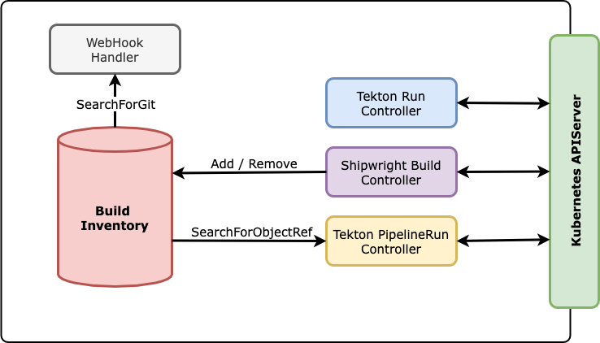

Shipwright Trigger
------------------

This project is a prototype of Shipwright Triggers, an application meant to trigger `BuildRun` from the following event sources:

- **WebHook**: Currently supports GitHub WebHook requests, extensible for other Git service providers as well
- **Tekton Custom-Tasks (`Run`)**: Integrates Shipwright into Tekton Pipelines via [Custom-Tasks][tektonCustomTasksTEP], allowing users to call out Shipwright Builds directly from pipelines.
- **Tekton Pipelines**: Integrates Tekton Pipelines into Shipwright, Builds will be triggered when a given Pipeline has reach the desired status

# How it works?

Please watch the videos below, showing the primary features of the Shipwright Trigger in practice.

## WebHook Support (GitHub)

<p align="center">
	<a alt="WebHook Support (GitHub)" url="https://youtu.be/c3CZlOXEhMY">
		
	</a>
</p>

The example uses a GitHub repository which upon receiving new commits (push), it triggers a new `BuildRun` using the WebHook interface. Using the following trigger settings on the `Build` resource:

```yaml
---
apiVersion: shipwright.io/v1alpha1
kind: Build
spec:
  trigger:
    secretRef:
      name: webhook-secret
    when:
      - name: push directly on the main branch
        type: Push
        branches:
          - main
```

The WebHook validation secret must be created as follows, note the `github-token` key needed to identify the service provider type, in this case GitHub:

```bash
kubectl create secret generic webhook-secret --from-literal="github-token=secret"
```

## Tekton Pipelines Integration

<p align="center">
	<a alt="Tekton Pipelines Integration" url="https://youtu.be/3H92CL8GF_Q">
		
	</a>
</p>

On the Tekton integration demo, the following trigger is added on the `Build` resource:

```yaml
---
apiVersion: shipwright.io/v1alpha1
kind: Build
spec:
  trigger:
    when:
      - name: tekton pipeline has "succeeded"
        type: Pipeline
        objectRef:
          name: pipeline-ex
          status:
            - Succeeded
```

And the following Tekton resources are used, please consider.

<details>
	<summary>Tekton Pipeline (Simple)</summary>

```yaml
---
apiVersion: tekton.dev/v1beta1
kind: Pipeline
metadata:
  name: pipeline-ex
spec:
  tasks:
    - name: example
      taskSpec:
        steps:
          - image: busybox
            script: echo "example task"
```

</details>

<details>
	<summary>Tekton Pipeline (Custom-Tasks)</summary>

```yaml
---
apiVersion: tekton.dev/v1beta1
kind: Pipeline
metadata:
  name: shipwright-ex
spec:
  tasks:
    - name: before
      taskSpec:
        steps:
          - image: busybox
            script: echo "before buildrun"
    - name: shipwright
      taskRef:
        apiVersion: shipwright.io/v1alpha1
        kind: Build
        name: nodejs-ex
      runAfter:
        - before
    - name: after
      taskSpec:
        steps:
          - image: busybox
            script: echo "after buildrun"
      runAfter: 
        - shipwright
```

</details>

# Install and Contribute

Before you install Shipwright Trigger, please install Shipwright Build Controller from branch [`shipwright-trigger-api`][buildControllerFork] ([PR #1008][buildPullRequest1008]), it contains the new API with triggers support:

```bash
git clone https://github.com/otaviof/build.git
git checkout shipwright-trigger-api

make install-strategies install GO_ARCH="amd64" IMAGE_NAMESPACE="otaviof/build"
```

Please note the parameters informed to the `make install` target and adjust them for own your environment.

With the Build Controller in place, you can install Shipwright Trigger:

```bash
make install KO_DOCKER_REPO="ghcr.io/otaviof"
```

The deployment happens on the `shipwright-build` namespace, the default location for the other related components. And, please remember to adjust `KO_DOCKER_REPO`.

## Tekton Custom-Tasks Feature Flag

In order to use Tekton's Custom-Tasks, you need to edit the `feature-flags` ConfigMap and set to `true` the `enable-custom-tasks` attribute. 

```bash
kubectl --namespace=tekton-pipelines edit configmap feature-flags
```

When using OpenShift Pipelines operator, the ConfigMap is located at the `openshift-pipelines` namespace instead.

# Components

<p align="center">
	
</p>

## Build Inventory

The inventory is the central component of Shipwright Trigger, it stores all the Build instances organized in a way that allows searching for types of triggers, depending on the Inventory client.

For example, the WebHook Handler will always search for Builds based on the Git repository URL, the type of event (Push or PullRequest), and the branch names. In other hand, the other Controllers will query the inventory based on the `.objectRef` attribute instead.

As you can see on the diagram above, almost all components are interacting with the Inventory using the specialized query methods `SearchForGit` and `SearchForObjectRef`.

## WebHook Handler

The WebHook handler is a simple HTTP server implementation which receives requests from the outside, and after processing the event, searches over Builds that should be activated. The search on the inventory happens in the same fashion as the controllers, however uses `SearchForGit` method.

This type of `SearchForGit` is meant to match the repository URL, the type of event and the branches affected. For instance, the WebHook event can have different types, like Push or PullRequest and plus the branch affected.

## Kubernetes Controllers

### Shipwright Build Controller

The Builds are added or removed from the Inventory through the Build Controller, responsible to reflect all Shipwright Build resources into the Inventory. On adding new entries, the Build is prepared for the subsequent queries.

### Tekton Run Controller

Watches for Tekton Run instances referencing Shipwright Builds, when a new instance is created it creates a new BuildRun. The controller also watches over the BuildRun instance, in order to reflect the status back to the Tekton Run parent.

The Tekton Run instances are part of the Custom-Tasks workflow, everytime Tekton finds a TaskRef resource outside of Tekton's scope, it creates a Run instance with the coordinates. In other words, to extend Tekton's functionality third party applications must watch and interact with those objects.

### Tekton PipelineRun Controller

The controller for PipelineRun instances is meant to react when a Pipeline reaches the desired status, so upon changes on the resource the controller checks on the inventory if there are triggers configured for the specific resource in question, in the desired status.

Upon the creation of a BuildRun instance, the PipelineRun object is labeled for the controller to be able to avoid reprocessing.


[buildControllerFork]: https://github.com/otaviof/build/tree/shipwright-trigger-api
[buildPullRequest1008]: https://github.com/shipwright-io/build/pull/1008
[tektonCustomTasksTEP]: https://github.com/tektoncd/community/blob/main/teps/0002-custom-tasks.md
[youtubeWebHookDemoCover]: https://img.youtube.com/vi/c3CZlOXEhMY/0.jpg
[youtubeWebHookDemo]: https://youtu.be/c3CZlOXEhMY
[youtubePipelinesDemoCover]: https://img.youtube.com/vi/3H92CL8GF_Q/0.jpg
[youtubePipelinesDemo]: https://youtu.be/3H92CL8GF_Q
 